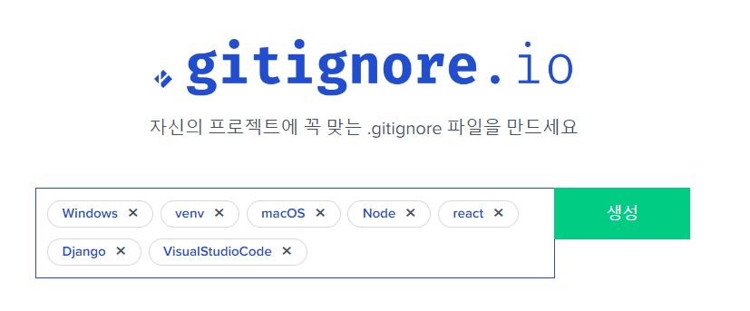

# E103

> 호미두

## 주요 기능

# ⚙️ 시스템 환경 및 구성

## 시스템 환경

-

## 시스템 구성

-

## 개발 환경

- Front
  - React 17.0.2
- Back
  - Django
- DB
  - MySQL
- 형상관리
  - Git

## 협업 툴

- Git
- Jira
- Notion
- Webex
- Mattermost

# 서비스 아키텍처


# 데이터 설계

## ERD


# 와이어프레임 및 프로토타입

## 와이어프레임


## 프로토타입

# Git 컨벤션 및 협업 전략

## Git 컨벤션

- gitmessages.txt 활용
- 이모지를 활용하여 커밋 종류 표현

`gitmessage.txt`

```
################
# <이모지> <제목> 의 형식으로 제목을 아래 공백줄에 작성
# 제목은 50자 이내 / 변경사항이 "무엇"인지 명확히 작성 / 끝에 마침표 금지
✨ 커밋 제목

# 바로 아래 공백은 지우지 마세요 (제목과 본문의 분리를 위함)

################
# 본문(구체적인 내용)을 아랫줄에 작성
# 여러 줄의 메시지를 작성할 땐 "-"로 구분 (한 줄은 72자 이내)
- 내용 1
- 내용 2
################
# 꼬릿말(footer)을 아랫줄에 작성 (현재 커밋과 관련된 이슈 번호 추가 등)
# Jira Smart commit 사용 시 Jira 이슈 또한 종료할 수 있음.
# 예) Close #7

################
# ✨ : 새로운 기능 추가
# 🐛 : 버그 수정
# 📚 : 문서 수정
# 🚨 : 테스트 코드 추가
# 🔨 : 코드 리팩토
# 📝 : 코드 의미에 영향을 주지 않는 변경사항
# 🔧 : 기타 변경사항, 프로`덕션 코드 변경사항 없음
################
```

- `--local` 은 해당 프로젝트에서만 적용
- `--global` 로 수정하면 컴퓨터에 있는 모든 깃 프로젝트에 적용

```bash
git config --local commit.template .gitmessage.txt
```

```bash
$ git add .

$ git commit
# 이후 gitmessage 작성
```

- 이 때 터미널 환경에서 `git commit`을 입력하면 `vi 에디터` 환경으로 나올 것입니다.
- 작성할 때에는 키보드 `i` 키를 누르면 되며, 작성 완료하고 저장하려면 `esc` 키를 누른 다음 `:wq!` 를 입력하고 엔터를 누르시면 됩니다.

## MR 템플릿

```
# Merge Request

## Part

- [ ] FE
- [ ] BE
- [ ] Data

## 어떤 이유로 MR를 하셨나요?

- [ ] feature 병합(feature issue #를 남겨주세요)
- [ ] 버그 수정(아래에 issue #를 남겨주세요)
- [ ] 코드 개선
- [ ] 기타(아래에 자세한 내용 기입해주세요)

## 기능 상세 설명

- 기능에서 어떤 부분이 구현되어야 하는 지 설명해주세요
```

## 협업 전략

```bash
$ git init
$ git remote add origin 개인 레포지토리 주소
$ git remote add upstream 팀 레포지토리 주소

$ git pull upstream 브랜치 ** 현재 함께 작업 중인 팀의 작업 내용은 꼭 풀 해야함**
$ git add .
$ git commit -m 커밋 메시지
$ git push origin 브랜치
```

1. 내 레포지토리의 브랜치에 푸시
2. 내 레포지토리에서 팀 레포지토리로 머지 리퀘스트 넣기

## Git ignore



# 팀원 소개 및 역할

### Backend

- 장지선(팀장)
- 김지현

### Frontend

- 조현빈
- 홍성목

### Data

- 백승진
- 이수민
